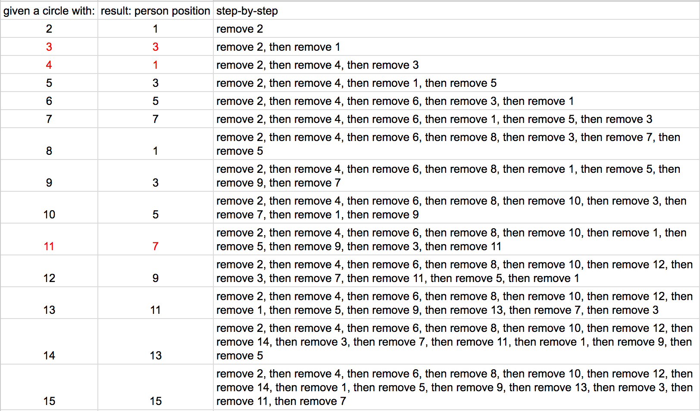

[VanHack](https://vanhack.com/) Hackathon 2016

Challenge from [A Thinking Ape](https://www.athinkingape.com/) - 2016-05-22

Given a circle with N amount of people numbered 1 to N, tell me which number will be the last to be chosen. We are going to remove from the circle every second person and go around the circle again and again, until we only have one person left.

See screenshot for reference:
